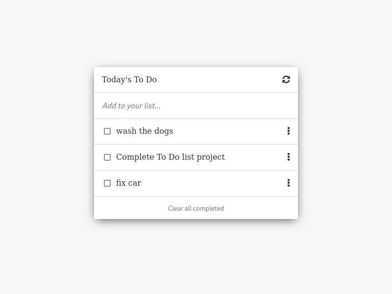

TODO LIST APP

# To Do list

> Using HTML, CSS, JavaScriptsm, Npm and Webpack

## Available Scripts

In the project directory, you can run:

### `npm run start`

Runs the app in the development mode.\
Open [http://localhost:8080](http://localhost:8080) to view it in the browser.

### `npm run build`

The page will reload if you make edits.\
You will also see any lint errors in the console.

## Built With

- HTML, CSS, JavaScriptsm, Npm and Webpack

## Getting Started

To get a local copy up follow these simple example steps.

### Prerequisites

- GIT, NODE, NPM

### Setup

Open a terminal or a git bash in the desired directory and run `https://github.com/hendridg/todo-list`

👤 **Author1**

- GitHub: [@hendridg](https://github.com/hendridg)
- Twitter: [@hendridg](https://twitter.com/hendridg)
- LinkedIn: [LinkedIn](https://linkedin.com/in/hendridg)

## 📝 License

This project is [MIT](./MIT.md) licensed.
